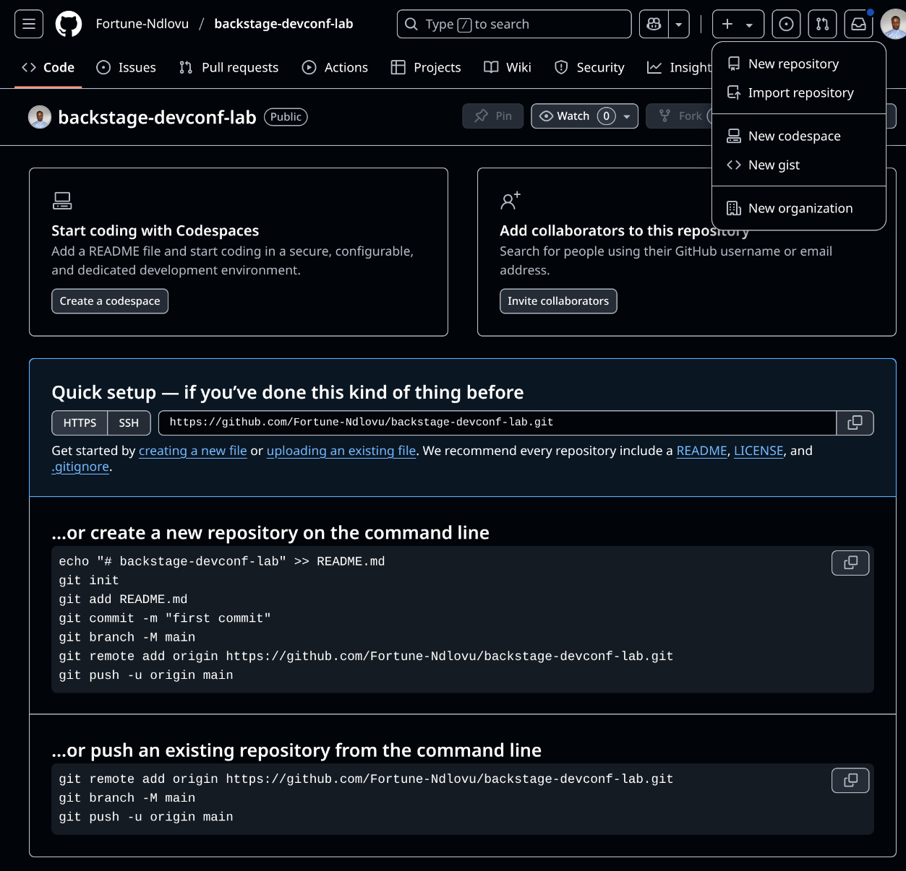
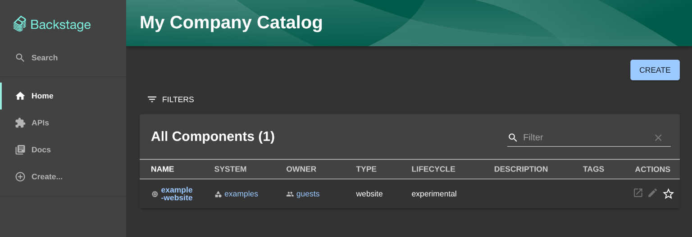

# 🎤 Backstage DevConf.cz Workshop

Welcome to the **Backstage DevConf.cz 2025 Lab**!  
In this hands-on workshop, you'll go from zero to a fully functional Backstage developer portal — installed, configured, and running locally on your machine. No prior Backstage experience required!

---

## 🚀 Step 1: Getting Set Up

Before we dive in, make sure you have the following tools installed:

- [Git](https://git-scm.com/downloads)
- [Node.js (v18+)](https://nodejs.org/en/download/)
- [Yarn](https://classic.yarnpkg.com/en/docs/install/)
- [Docker](https://www.docker.com/products/docker-desktop/)

To confirm you're good to go, run:


```bash
node -v
yarn -v
git --version
docker --version
```

## 🏗️ Step 2: Create a New Backstage App

Run the following command to create your app:

```bash
npx @backstage/create-app
```

When prompted, enter the name of your app:

```bash
? Enter a name for the app [required] → backstage-devconf-lab
```

Once it’s finished scaffolding, move into the app directory:

```bash
cd backstage-devconf-lab/
```

## 🌍 Step 3: Push to GitHub

Now let’s get your app into a GitHub repository:

1. Navigate to [GitHub](https://github.com/) and click `New repository`.

2. Name it: `backstage-devconf-lab` (same as your app folder)

3. ❗️Important: Do not add a README — your app already has one!

4. Click Create Repository

You should see the following viewport:


Then return to your terminal and run:

```bash
git init
git branch -M main
git add .
git commit -s -m "Initial commit"
git remote add origin https://github.com/<your-username>/backstage-devconf-lab.git
git push -u origin main
```

💡 Replace <your-username> with your actual GitHub username.
You should now see your project live on GitHub!

## 🔍 Step 4: Run the App Locally

Start the development server:

```bash
yarn start
```

You should see the following viewport:



🎉 That’s it! You’re now running a fresh Backstage developer portal locally.

Next up: We’ll customize your app name and start configuring GitHub Authentication 🎸!

---

## 🎨 Step 5: Customize App Name

Open the `app-config.yaml` file in the root of your project (yep, same level as your `package.json`):

Look for the following section:

```yaml
app:
  title: My Company Catalog

organization:
  name: My Company
```

Change it to something that represents your vibe. For example:

```yaml
app:
  title: Rockit Engine

organization:
  name: Rockit Rockets
```
💡 This updates the name shown in the header of your Backstage UI.

The default `.gitignore` file created with the app excludes `*.local.yaml` from source control for you, so you can add passwords or tokens directly into the `app-config.local.yaml`.

Restart Backstage from the terminal, by stopping it with `Control-C`, and starting it with `yarn start` to see the changes. The default Backstage Catalog screen will look like this:


References: <https://backstage.io>
