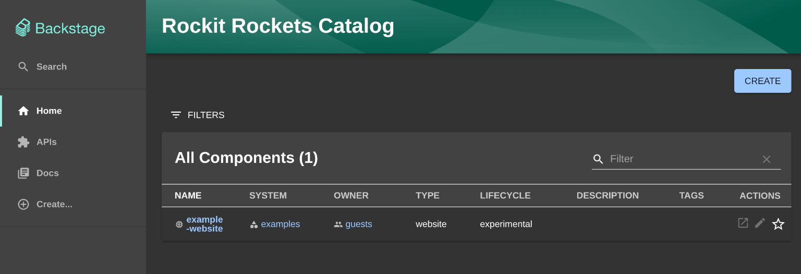
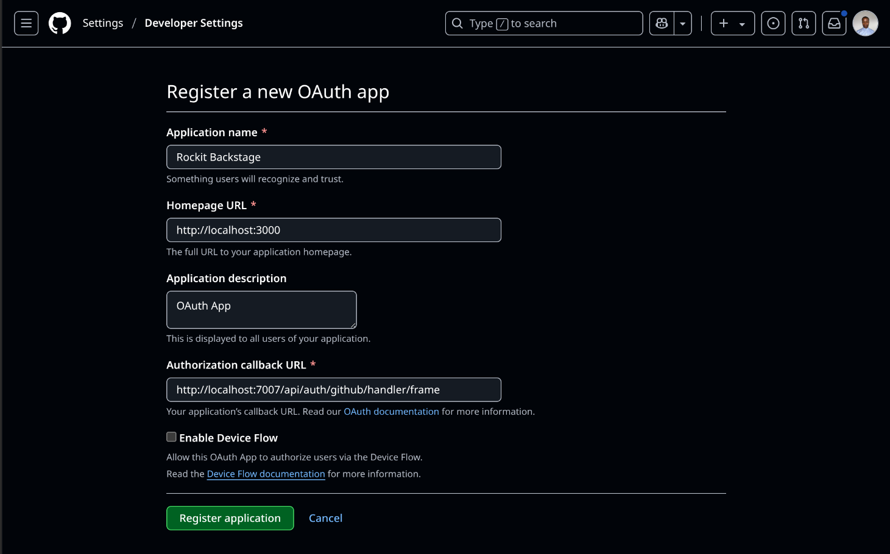
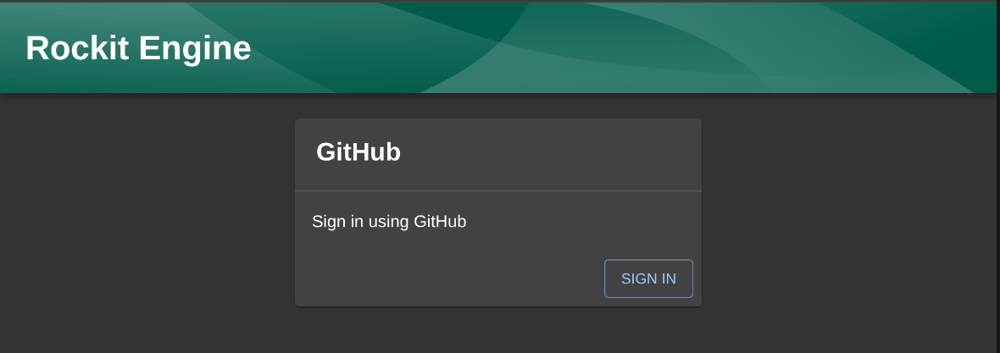
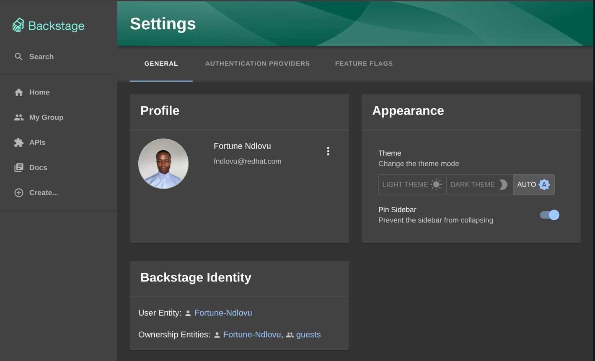

# 🎤 Backstage DevConf.cz Workshop

Welcome to the **Backstage DevConf.cz 2025 Lab**!  
In this hands-on workshop, you'll go from zero to a fully functional Backstage developer portal — installed, configured, and running locally on your machine. No prior Backstage experience required!

---

## 🚀 Step 1: Getting Set Up

Before we dive in, make sure you have the following tools installed:

- [Git](https://git-scm.com/downloads)
- [Node.js (v18+)](https://nodejs.org/en/download/)
- [Yarn](https://classic.yarnpkg.com/en/docs/install/)
- [Docker](https://www.docker.com/products/docker-desktop/)

To confirm you're good to go, run:

```bash
node -v
yarn -v
git --version
docker --version
```

## 🏗️ Step 2: Create a New Backstage App

Run the following command to create your app:

```bash
npx @backstage/create-app
```

When prompted, enter the name of your app:

```bash
? Enter a name for the app [required] → backstage-devconf-lab
```

Once it’s finished scaffolding, move into the app directory:

```bash
cd backstage-devconf-lab/
```

## 🌍 Step 3: Push to GitHub

Now let’s get your app into a GitHub repository:

1. Navigate to [GitHub](https://github.com/) and click `New repository`.

2. Name it: `backstage-devconf-lab` (same as your app folder)

3. ❗️Important: Do not add a README — your app already has one!

4. Click Create Repository

You should see the following viewport:


Then return to your terminal and run:

```bash
git init
git branch -M main
git add .
git commit -s -m "Initial commit"
git remote add origin https://github.com/<your-username>/backstage-devconf-lab.git
git push -u origin main
```

💡 Replace `<your-username>` with your actual GitHub username.

You should now see your project live on GitHub!

## 🔍 Step 4: Run the App Locally

Start the development server:

```bash
yarn start
```

You should see the following viewport:


🎉 That’s it! You’re now running a fresh Backstage developer portal locally.

Next up: We’ll customize your app name and start configuring GitHub Authentication 🎸!

---

## 🎨 Step 5: Customize App Name

Open the `app-config.yaml` file in the root of your project (yep, same level as your `package.json`):

Look for the following section:

```yaml
app:
  title: My Company Catalog

organization:
  name: My Company
```

Change it to something that represents your vibe. For example:

```yaml
app:
  title: Rockit Engine

organization:
  name: Rockit Rockets
```

💡 This updates the name shown in the header of your Backstage UI.

The default `.gitignore` file created with the app excludes `*.local.yaml` from source control for you, so you can add passwords or tokens directly into the `app-config.local.yaml`.

Restart Backstage from the terminal, by stopping it with `Control-C`, and starting it with `yarn start` to see the changes. The default Backstage Catalog screen will look like this:



 🎉 Well Done! Your App Has a Name — Now Let’s  set up **GitHub Authentication** so you can log in securely 🔐

---

## 🔑 Step 6: Setting Up GitHub Authentication

Backstage supports a bunch of auth providers, but for this workshop, we’ll use GitHub — it’s fast, familiar, and perfect for devs.

### 🔑 Step 6.1: Add a new app to GitHub

Go to <https://github.com/settings/applications/new> to create your OAuth App.

Homepage URL should point to Backstage's frontend, in our tutorial it would be `http://localhost:3000`
Authorization callback URL should point to the auth backend, `http://localhost:7007/api/auth/github/handler/frame`

You should see the following viewport:


Click `Register application` to generate a new `Client Secret` and take a note of the `Client ID` and the `Client Secret`.

### 🔑 Step 6.2: Add the credentials to the configuration

Open `app-config.local.yaml` add the below configuration and replace the values with the `Client ID` and the `Client Secret` from GitHub.

```yaml
auth:
  environment: development
  providers:
    github:
      development:
        clientId: YOUR CLIENT ID
        clientSecret: YOUR CLIENT SECRET
        signIn:
          resolvers:
            - resolver: usernameMatchingUserEntityName
```

❗️Remember to update your OAuth App on GitHub after you have generated your `Client secret`.

### 🔑 Step 6.3: Add sign-in option to the frontend

This step is needed to change the sign-in page. Get ready to dive into the code.

1. Open `packages/app/src/App.tsx` in your favorite code editor and add:

    ```bash
    import { githubAuthApiRef } from '@backstage/core-plugin-api';
    import { SignInProviderConfig, SignInPage } from '@backstage/core-components';

    const githubProvider: SignInProviderConfig = {
    id: 'github-auth-provider',
    title: 'GitHub',
    message: 'Sign in using GitHub',
    apiRef: githubAuthApiRef,
    };
    ```

    💡 You may notice that the  `'@backstage/core-components'` package is already imported, feel free to adjust the imported components as needed.

2. Search for `const app = createApp({` in this file, and below `apis,`, find `components` and update it to this:

    ```bash
    components: {
        SignInPage: props => (
            <SignInPage
                {...props}
                auto
                provider={githubProvider}
            />
        ),
    },
    ```

3. To add the provider to the backend we will first need to install the package by running this command, from your Backstage root directory:

   ```bash
   yarn --cwd packages/backend add @backstage/plugin-auth-backend-module-github-provider
   ```

4. Then in `packages/backend/src/index.ts` find this line:

   ```bash
   backend.add(import('@backstage/plugin-auth-backend'));
   ```

    and add the following line right underneath:

    ```bash
    backend.add(import('@backstage/plugin-auth-backend-module-github-provider'));
    ```

5. For the sake of this guide we'll simply step you though adding a User to the org.yaml file that is included when you create a new Backstage instance. Let's do that:

    First open the `/examples/org.yaml` file and at the bottom we'll add the following YAML:

    ```yaml
    ---
    apiVersion: backstage.io/v1alpha1
    kind: User
    metadata:
    name: YOUR GITHUB USERNAME
    spec:
    memberOf: [guests]
    ```

Restart Backstage from the terminal, by stopping it with `Control-C`, and starting it with `yarn start` . You should be welcomed by a login prompt. For example:



Click `SIGN IN`

You should see a popup asking to authorize your OAuth App, Click `Authorize`! Once logged into your Backstage app click the `Settings` button you should see your user profile. For example:



🥳 You're Logged In, You did it! You just completed the GitHub OAuth handshake like a total boss 🕺💻. Now let’s bring in **TechDocs**, Backstage’s built-in documentation generator that renders Markdown using MkDocs and lives right inside your portal 🧭.

---

## 📚 Step 7: Enabling Techdocs

With **TechDocs**, you can render Markdown (powered by MkDocs) right inside your portal. Let’s get those docs live in your app in just a few quick steps. 🛠️✨

1. Create an `mkdocs.yml` file in the root of your repository with the following content:

    ```bash
    site_name: 'example-docs'

    nav:
      - Home: index.md

    plugins:
      - techdocs-core
    ```

2. Adding the following lines to your root `catalog-info.yaml` file:

    ```bash
    metadata:
      annotations:
        backstage.io/techdocs-ref: dir:.
    ```

3. Create a `/docs` folder in the root of your repository with at least an `index.md` file in it. You can add the following example content into the `docs/index.md`:

    ```bash
    # example docs

    This is a basic example of documentation.
    ```

    You can style and expand this later — but this gives us something to preview right now.

    Run the TechDocs CLI in your project root:

    ```bash
    npx @techdocs/cli serve
    ```

    This builds and serves your docs locally — super useful for testing before committing.

Next git add, commit, and push your changes. we will register the repo as a component.

Restart Backstage from the terminal, by stopping it with `Control-C`, and starting it with `yarn start` .

Once logged in, click `Create...` in the sidebar. Then click `REGISTER EXISTING COMPONENT`.

Input the URL of your repository for example:
`https://github.com/Fortune-Ndlovu/backstage-devconf-lab/blob/main/catalog-info.yaml`

click `ANALYZE`, then click `IMPORT`, the click `VIEW COMPONENT`

Docs in the sidebar 🧭.
You should see your beautifully rendered TechDocs powered by your local markdown! 🎉

References: <https://backstage.io>
